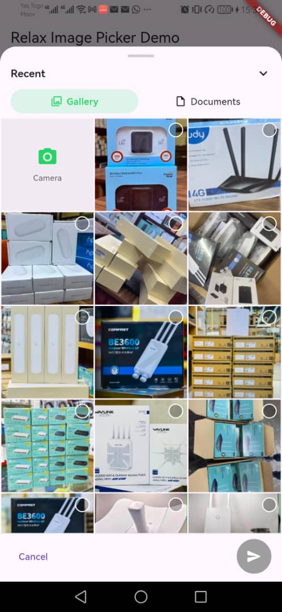
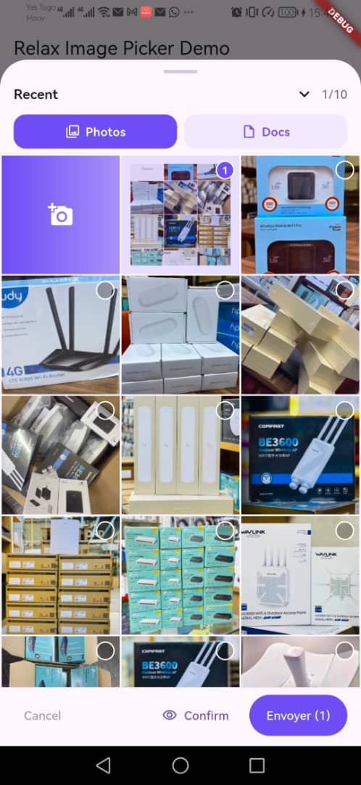

# Relax Image Picker

## Features

- 📱 **WhatsApp-style UX** — bottom-sheet interface with smooth animations
- 🖼️ **Gallery browsing** — paginated media loading with album selection
- 📷 **Camera integration** — capture photos and videos without leaving the picker
- 📄 **Document selection** — pick files from device storage, with recent-documents recall between sessions
- 👁️ **Full-screen preview** — review images, videos, and documents before confirming
- 🗜️ **Optional compression** — shrink images on the fly
- 🔒 **Smart permissions** — handles Android 13+ scoped storage and iOS limited photo access
- 🎨 **Deep customization** — `RelaxPickerTheme` exposes colors, text/button styles, icons, labels, and full widget-slot builders
- ⚡ **High performance** — lazy loading, thumbnail caching, and optimized scrolling

## Screenshots

| Default theme | Custom theme + builders |
|:---:|:---:|
|  |  |

## Installation

Add the dependency to your `pubspec.yaml`:

```yaml
dependencies:
  relax_image_picker: ^1.0.0
```

Then run:

```sh
flutter pub get
```

### Platform setup

> **Declare only what you actually use.** The lists below are the *full set* for
> the "everything enabled" case. Requesting permissions you don't need is the
> most common cause of store rejections — pick the minimal set that matches the
> features you turn on (see [Minimal permission sets](#minimal-permission-sets)).

#### Android

Declare the permissions your enabled features need in
`android/app/src/main/AndroidManifest.xml`:

```xml
<!-- Camera capture (enableCamera) -->
<uses-permission android:name="android.permission.CAMERA" />
<!-- Recording video *with sound* via the in-picker camera -->
<uses-permission android:name="android.permission.RECORD_AUDIO" />

<!-- Gallery browsing — Android 13+ (API 33+) granular media permissions -->
<uses-permission android:name="android.permission.READ_MEDIA_IMAGES" />
<uses-permission android:name="android.permission.READ_MEDIA_VIDEO" />
<!-- Android 14+ (API 34+) partial / "selected photos" access -->
<uses-permission android:name="android.permission.READ_MEDIA_VISUAL_USER_SELECTED" />
<!-- Gallery browsing on older versions (API ≤ 32) -->
<uses-permission android:name="android.permission.READ_EXTERNAL_STORAGE"
    android:maxSdkVersion="32" />
```

> **Documents (`allowDocuments`) need no storage permission.** Document picking
> goes through the Storage Access Framework (SAF), so an app that only picks
> documents can omit *all* the `READ_MEDIA_*` / `READ_EXTERNAL_STORAGE` lines.
>
> The package never requests `MANAGE_EXTERNAL_STORAGE` (the broad "All files
> access" permission that triggers a heavy Play review).

#### iOS

Add usage descriptions to `ios/Runner/Info.plist`. **Make the strings specific
to your app** — Apple frequently rejects vague purpose strings. Replace the
examples below with text that states the concrete user benefit.

```xml
<!-- Gallery browsing -->
<key>NSPhotoLibraryUsageDescription</key>
<string>Allows you to attach photos and videos to your messages.</string>
<!-- Camera capture (enableCamera) -->
<key>NSCameraUsageDescription</key>
<string>Lets you take a photo or record a video to send.</string>
<!-- Recording video with sound -->
<key>NSMicrophoneUsageDescription</key>
<string>Records sound when you capture a video.</string>
```

### Minimal permission sets

Add only the lines for the features you enable:

| Feature you use | Android | iOS |
|---|---|---|
| Gallery (`allowImages` / `allowVideos`) | `READ_MEDIA_IMAGES`, `READ_MEDIA_VIDEO`, `READ_MEDIA_VISUAL_USER_SELECTED`, `READ_EXTERNAL_STORAGE` (≤32) | `NSPhotoLibraryUsageDescription` |
| Camera photo (`enableCamera`) | `CAMERA` | `NSCameraUsageDescription` |
| Camera video with sound | `CAMERA`, `RECORD_AUDIO` | `NSCameraUsageDescription`, `NSMicrophoneUsageDescription` |
| Documents only (`allowDocuments`) | *(none — uses SAF)* | *(none — uses the system file picker)* |

### Store review notes

- **Google Play — Photo & Video Permissions policy.** Requesting
  `READ_MEDIA_IMAGES` / `READ_MEDIA_VIDEO` is allowed for a media picker (a
  legitimate core use case), but Google may ask you to complete the *Photo and
  Video Permissions declaration* in the Play Console. If your app only needs
  occasional one-off selection, consider relying on the system **Android Photo
  Picker** instead, which requires no permission.
- **Apple App Store.** The `*UsageDescription` strings are mandatory — without
  them the app crashes on access and is rejected. Vague strings are a common
  rejection reason; describe the concrete user-facing benefit.
- **Data safety / privacy.** Declare media and camera access in the Play
  *Data safety* form and your App Store *privacy* details.

## Usage

### Basic usage

```dart
import 'package:relax_image_picker/relax_image_picker.dart';

final result = await RelaxImagePicker.pick(context);

print('Total files: ${result.files.length}');
print('Images: ${result.images.length}');
print('Videos: ${result.videos.length}');
print('Documents: ${result.documents.length}');

for (final file in result.files) {
  print('File: ${file.path} · ${file.size} bytes');
}
```

`pick` always returns a `RelaxPickerResult`. When the user cancels or permissions
are denied, the result is empty (`result.isEmpty == true`).

### Advanced configuration

```dart
final result = await RelaxImagePicker.pick(
  context,
  allowImages: true,
  allowVideos: true,
  allowDocuments: true,
  enableCamera: true,
  enablePreview: true,
  maxSelection: 30,
  enableCompression: false,
  acceptedDocumentTypes: ['pdf', 'doc', 'docx'],
  accentColor: const Color(0xFF25D366),
  title: 'Select media',
);
```

### Theming

Pass a `RelaxPickerTheme` to override colors, text and button styles, icons, and
labels. Every style field is nullable and falls back to a sensible default, so an
empty `RelaxPickerTheme()` reproduces the default look.

```dart
final result = await RelaxImagePicker.pick(
  context,
  theme: RelaxPickerTheme(
    accentColor: const Color(0xFF6C4DF6),
    sheetBorderRadius: 32,
    tileBorderRadius: 18,
    titleTextStyle: const TextStyle(fontSize: 18, fontWeight: FontWeight.w800),
    maxSelectionLabelBuilder: (max) => 'You can pick at most $max',
  ),
);
```

### Widget-slot builders

For full control, `RelaxPickerTheme` exposes builders that let you replace
individual widgets entirely (send button, tabs, media/document tiles, empty
states, the bottom bar, the capture button, and more). Any builder left null
falls back to the default themed widget.

```dart
RelaxPickerTheme(
  accentColor: accent,
  sendButtonBuilder: (context, {required selectedCount, required processing, required onSend}) {
    return FilledButton(
      onPressed: onSend,
      child: processing
          ? const CircularProgressIndicator(strokeWidth: 2)
          : Text('Send ($selectedCount)'),
    );
  },
);
```

See the [`example/`](example/) app for a complete demonstration mixing style
overrides and widget builders.

## API reference

### `RelaxImagePicker.pick()`

Opens the media picker with the given configuration and returns the selection.

| Parameter | Type | Default | Description |
|---|---|---|---|
| `context` | `BuildContext` | required | Build context used to show the sheet |
| `allowImages` | `bool` | `true` | Enable image selection |
| `allowVideos` | `bool` | `true` | Enable video selection |
| `allowDocuments` | `bool` | `true` | Enable document selection |
| `enableCamera` | `bool` | `true` | Show the in-picker camera |
| `enablePreview` | `bool` | `true` | Enable the full-screen preview step |
| `maxSelection` | `int` | `30` | Maximum number of items selectable |
| `enableCompression` | `bool` | `false` | Compress images on selection |
| `acceptedDocumentTypes` | `List<String>?` | `null` | Allowed document extensions |
| `accentColor` | `Color` | `0xFF25D366` | Accent color when no `theme` is given |
| `theme` | `RelaxPickerTheme?` | `null` | Full UI customization |
| `title` | `String` | `'Select media'` | Sheet title |
| `confirmButtonText` / `cancelButtonText` / `validateButtonText` | `String` | — | Action labels |
| `galleryTabText` / `cameraTabText` / `documentsTabText` | `String` | — | Tab labels |

**Returns:** `Future<RelaxPickerResult>`

### `RelaxPickerResult`

All selected media organized by type.

| Property | Type | Description |
|---|---|---|
| `files` | `List<RelaxMediaFile>` | All selected files |
| `images` | `List<RelaxImageFile>` | Selected images only |
| `videos` | `List<RelaxVideoFile>` | Selected videos only |
| `documents` | `List<RelaxDocumentFile>` | Selected documents only |
| `isEmpty` | `bool` | `true` when nothing was selected |
| `hasMedia` | `bool` | `true` when at least one file was selected |

### Media file models

**`RelaxMediaFile`** (base) — `id`, `path`, `mimeType`, `size`, `thumbnailPath?`, `creationDate?`

- **`RelaxImageFile`** adds `width`, `height`, `albumId?`
- **`RelaxVideoFile`** adds `duration`, `width`, `height`, `isMuted`, `albumId?`
- **`RelaxDocumentFile`** adds `fileName`, `extension`, `canPreview` (plus `toJson` / `fromJson` for caching)

## Platform support

| Platform | Supported | Notes |
|---|---|---|
| Android | ✅ | Scoped storage (Android 13+) and legacy storage |
| iOS | ✅ | Limited photo library access (iOS 14+) supported |

## Architecture

```
lib/src/
├── controllers/   # Business logic and state management
├── models/        # Data models, result objects, theme & builders
├── services/      # Platform integrations (photo_manager, camera, file_picker)
├── widgets/       # UI components (gallery, camera, document pickers, preview)
└── relax_image_picker.dart  # Public API
```

## Contributing

Issues and pull requests are welcome in the
[relax-tech monorepo](https://github.com/KalybosPro/relax-tech).

## License

This project is licensed under the MIT License — see the [LICENSE](LICENSE) file for details.
