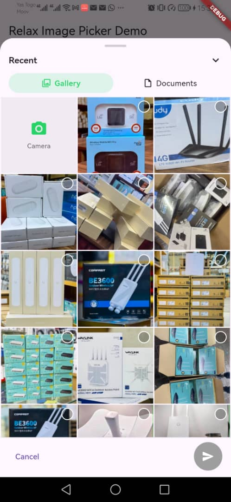
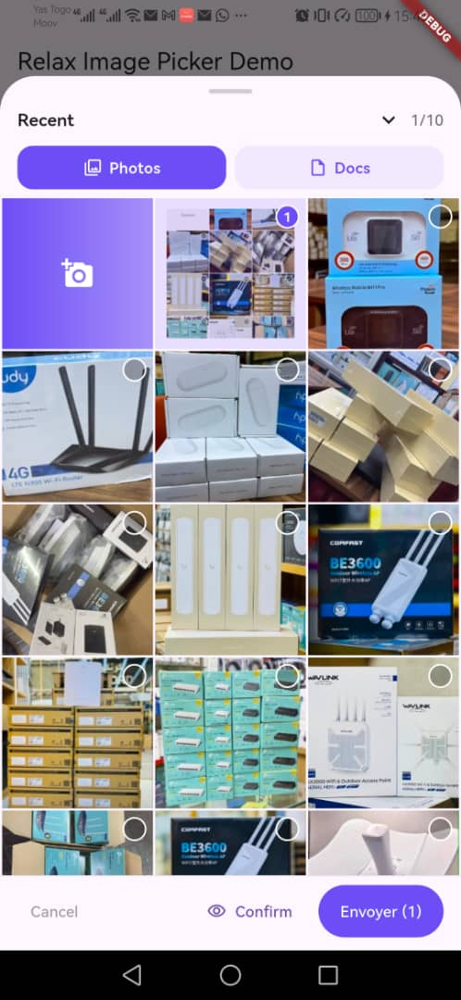

# Relax Image Picker

## Features

- 📱 **WhatsApp-style UX** — bottom-sheet interface with smooth animations
- 🖼️ **Two gallery modes** — the permission-free **OS photo picker** (default) or a WhatsApp-style **in-app grid** rendered right in the sheet
- 📷 **Camera integration** — capture photos and videos without leaving the picker
- 🎬 **Camera + gallery together** — the camera page keeps a thumbnail strip you drag up to reveal the full grid; `cameraFirst: true` opens straight on it
- 👆 **Gallery-like gestures** — tap previews, a long press starts multi-selection (bubbles stay hidden until then)
- 📄 **Document selection** — pick files from device storage, with recent-documents recall between sessions
- 👁️ **Full-screen preview** — review images and documents, and **play videos** (captured or picked) before confirming
- 🗜️ **Optional compression** — shrink images on the fly
- 🔒 **Permission-free by default** — the OS-picker mode needs no `READ_MEDIA_*` and no Google Play *Photo & Video Permissions* review (the grid mode is opt-in)
- 🎨 **Deep customization** — `RelaxPickerTheme` exposes colors, text/button styles, icons, labels, and full widget-slot builders
- ⚡ **Lightweight** — no in-app library scanning; the OS returns only what the user picks

## Screenshots

| Default theme | Custom theme + builders |
|:---:|:---:|
|  |  |

## Installation

Add the dependency to your `pubspec.yaml`:

```yaml
dependencies:
  relax_image_picker: ^3.0.0
```

Then run:

```sh
flutter pub get
```

## Gallery modes

The picker offers two ways to browse photos/videos, selected with `galleryMode`:

| Mode | UX | Permissions | Play policy |
|---|---|---|---|
| `RelaxGalleryMode.systemPicker` **(default)** | Opens the **OS photo picker** (Android Photo Picker / iOS `PHPickerViewController`) | **None** | Not subject to the *Photo & Video Permissions* policy |
| `RelaxGalleryMode.inAppGrid` | Renders the **WhatsApp-style grid** inside the sheet (album selector, multi-select, "Selected photos" banner) | `READ_MEDIA_IMAGES` / `READ_MEDIA_VIDEO` (+ iOS photo-library string) | **Requires** a completed Play *Photo & Video Permissions* declaration |

```dart
// Permission-free (recommended for occasional attach):
RelaxImagePicker.pick(context); // systemPicker is the default

// In-app grid (browsing the whole library is a core feature):
RelaxImagePicker.pick(context, galleryMode: RelaxGalleryMode.inAppGrid);
```

> **Choosing a mode.** Use `systemPicker` unless browsing the entire library is a
> *core feature* of your app. `inAppGrid` reintroduces `READ_MEDIA_*`, so Google
> Play will require you to justify it in the *Photo and Video Permissions*
> declaration (and reject apps that only need occasional access).

## Selection gestures

The grid opens as a plain gallery: **no selection bubbles are drawn**. Selection
starts on a **long press**, which turns the bubbles on for every tile — from then
on a tap toggles selection, and a long press opens the preview. Deselecting the
last item hides the bubbles again.

| Gesture | Bubbles hidden (default) | Bubbles shown (selection mode) |
|---|---|---|
| Tap | Full-screen preview of that item | Select / deselect it |
| Long press | Selects it → **turns the bubbles on** | Full-screen preview |

With `enablePreview: false` there is nothing to preview, so a tap selects
directly (and reveals the bubbles).

Writing your own tile with `assetTileBuilder`? It receives `selectionMode` —
draw the bubble only when it is `true`.

## The camera page

Whatever `cameraFirst` is set to, the camera is never a bare viewfinder: the
gallery follows it as a horizontal strip of small squares pinned at the bottom,
so the user can keep picking photos while shooting. Dragging the strip up (or
tapping its handle) grows it into the very same grid the default layout shows —
camera tile, album selector, limited-access banner and all. Dragging back down,
tapping the camera tile inside the grid, or the back gesture returns to the
camera.

`cameraFirst` only decides **where the picker starts**:

```dart
RelaxImagePicker.pick(
  context,
  galleryMode: RelaxGalleryMode.inAppGrid, // required
  cameraFirst: true,                       // defaults to false
);
```

- `false` (default) — the picker opens on the grid sheet; tapping the camera
  tile opens the camera page above it, and closing the camera comes back to the
  sheet.
- `true` — the picker opens directly on the camera page; closing it closes the
  picker.

Notes:

- `cameraFirst` needs `galleryMode: RelaxGalleryMode.inAppGrid` **and**
  `enableCamera: true`; it is ignored otherwise.
- Captures are appended to the current selection instead of closing the picker,
  and lead both the strip and the grid so a fresh shot is always visible.
- A video recording can be **held and resumed** — the control sits next to the
  capture button while recording, both halves land in the same file, and the
  counter only runs while frames do. Devices that don't support it keep
  recording (the failure is logged, not surfaced).
- The documents view is not part of the camera page — use the sheet's Documents
  tab for those.

### Least-privilege in `inAppGrid` mode

The grid requests `READ_MEDIA_*` **lazily — only when its gallery view actually
loads**, never at app launch or when the picker first opens. That keeps the
prompt tied to the user deliberately opening the gallery, which is exactly what
Google Play looks for. The recommended flow for a messaging-style app:

```text
Open conversation        → no permission requested
Tap 📎 (attach)          → sheet shows Camera · Documents · Gallery
Tap "Gallery"            → READ_MEDIA_* requested here, then the grid loads
```

Because both modes ship in the package, you can also offer the **system picker**
for quick one-off attachment and reserve the **in-app grid** for users who want
to browse their whole library — honoring least-privilege either way. The grid
also supports Android 14+/iOS "Selected photos" (partial) access via the
built-in *Manage* banner, so users can grant a subset instead of the whole
library.

> **Before publishing,** re-read Google's current
> [Photo and video permissions policy](https://support.google.com/googleplay/android-developer/answer/14115180)
> and make sure your Play Console declaration matches how your app actually uses
> the library.

### Platform setup

> **The gallery needs no media-storage permission.** Browsing is delegated to
> the OS photo picker and documents to the Storage Access Framework, so the only
> permissions you ever declare are for the optional **in-app camera**.

#### Android

Gallery browsing goes through the Android Photo Picker and documents through the
Storage Access Framework, so you **never** declare `READ_MEDIA_IMAGES`,
`READ_MEDIA_VIDEO` or `READ_EXTERNAL_STORAGE`. Only the in-app camera
(`enableCamera`) needs permissions, in
`android/app/src/main/AndroidManifest.xml`:

```xml
<!-- Camera capture (only when enableCamera: true) -->
<uses-permission android:name="android.permission.CAMERA" />
<!-- Recording video *with sound* via the in-picker camera -->
<uses-permission android:name="android.permission.RECORD_AUDIO" />
```

> With `enableCamera: false`, the picker needs **zero** manifest permissions.
> The package also never requests `MANAGE_EXTERNAL_STORAGE`.

**Using `RelaxGalleryMode.inAppGrid`?** The in-app grid reads the library, so add
the granular media permissions (and complete the Play declaration — see
[Gallery modes](#gallery-modes)):

```xml
<uses-permission android:name="android.permission.READ_MEDIA_IMAGES" />
<uses-permission android:name="android.permission.READ_MEDIA_VIDEO" />
<!-- Android 14+ partial ("Selected photos") access -->
<uses-permission android:name="android.permission.READ_MEDIA_VISUAL_USER_SELECTED" />
<!-- Android 12 and below -->
<uses-permission android:name="android.permission.READ_EXTERNAL_STORAGE"
    android:maxSdkVersion="32" />
```

> **Legacy `READ_EXTERNAL_STORAGE`.** The `camera` dependency declares
> `WRITE_EXTERNAL_STORAGE` (`maxSdkVersion="28"`), which makes Android's manifest
> merger auto-add an *unscoped* legacy `READ_EXTERNAL_STORAGE`. It is inert on
> Android 13+ and does **not** fall under the Photo & Video Permissions policy,
> but you can scope it out of modern Android by adding this to your app manifest
> (with `xmlns:tools="http://schemas.android.com/tools"` on `<manifest>`):
>
> ```xml
> <uses-permission android:name="android.permission.READ_EXTERNAL_STORAGE"
>     android:maxSdkVersion="32" tools:node="replace" />
> ```

#### iOS

Gallery picking uses the system photo picker (`PHPickerViewController`), which
needs **no** `NSPhotoLibraryUsageDescription`. Only add usage strings for the
in-app camera in `ios/Runner/Info.plist`, and **make them specific** — Apple
frequently rejects vague purpose strings:

```xml
<!-- Camera capture (enableCamera) -->
<key>NSCameraUsageDescription</key>
<string>Lets you take a photo or record a video to send.</string>
<!-- Recording video with sound -->
<key>NSMicrophoneUsageDescription</key>
<string>Records sound when you capture a video.</string>
```

### Minimal permission sets

Add only the lines for the features you enable:

| Feature you use | Android | iOS |
|---|---|---|
| Gallery (`allowImages` / `allowVideos`) | *(none — OS photo picker)* | *(none — system photo picker)* |
| Documents (`allowDocuments`) | *(none — uses SAF)* | *(none — uses the system file picker)* |
| Camera photo (`enableCamera`) | `CAMERA` | `NSCameraUsageDescription` |
| Camera video with sound | `CAMERA`, `RECORD_AUDIO` | `NSCameraUsageDescription`, `NSMicrophoneUsageDescription` |

### Store review — no media-permission gate

Because gallery browsing uses the OS photo picker, the app declares **no**
`READ_MEDIA_IMAGES` / `READ_MEDIA_VIDEO`, so Google Play's *Photo and Video
Permissions policy* declaration **does not apply** — the single most common
media-picker rejection is removed entirely. The OS picker also gives the user
least-privilege, per-pick access with no in-app library scanning.

- **Apple App Store.** The camera `*UsageDescription` strings are mandatory when
  `enableCamera` is on — without them the app crashes on access. The photo
  library string is **not** required for the system picker.
- **Data safety / privacy.** Still declare any camera access in the Play *Data
  safety* form and your App Store *privacy* details.

## Usage

### Basic usage

```dart
import 'package:relax_image_picker/relax_image_picker.dart';

final result = await RelaxImagePicker.pick(context);

print('Total files: ${result.files.length}');
print('Images: ${result.images.length}');
print('Videos: ${result.videos.length}');
print('Documents: ${result.documents.length}');

for (final file in result.files) {
  print('File: ${file.path} · ${file.size} bytes');
}
```

`pick` always returns a `RelaxPickerResult`. When the user cancels or permissions
are denied, the result is empty (`result.isEmpty == true`).

### Advanced configuration

```dart
final result = await RelaxImagePicker.pick(
  context,
  allowImages: true,
  allowVideos: true,
  allowDocuments: true,
  enableCamera: true,
  enablePreview: true,
  maxSelection: 30,
  enableCompression: false,
  cameraFirst: false,
  acceptedDocumentTypes: ['pdf', 'doc', 'docx'],
  accentColor: const Color(0xFF25D366),
  title: 'Select media',
);
```

### Theming

Pass a `RelaxPickerTheme` to override colors, text and button styles, icons, and
labels. Every style field is nullable and falls back to a sensible default, so an
empty `RelaxPickerTheme()` reproduces the default look.

```dart
final result = await RelaxImagePicker.pick(
  context,
  theme: RelaxPickerTheme(
    accentColor: const Color(0xFF6C4DF6),
    sheetBorderRadius: 32,
    tileBorderRadius: 18,
    titleTextStyle: const TextStyle(fontSize: 18, fontWeight: FontWeight.w800),
    maxSelectionLabelBuilder: (max) => 'You can pick at most $max',
  ),
);
```

### Widget-slot builders

For full control, `RelaxPickerTheme` exposes builders that let you replace
individual widgets entirely (send button, tabs, media/document tiles, empty
states, the bottom bar, the capture button, and more). Any builder left null
falls back to the default themed widget.

```dart
RelaxPickerTheme(
  accentColor: accent,
  sendButtonBuilder: (context, {required selectedCount, required processing, required onSend}) {
    return FilledButton(
      onPressed: onSend,
      child: processing
          ? const CircularProgressIndicator(strokeWidth: 2)
          : Text('Send ($selectedCount)'),
    );
  },
);
```

See the [`example/`](example/) app for a complete demonstration mixing style
overrides and widget builders.

## API reference

### `RelaxImagePicker.pick()`

Opens the media picker with the given configuration and returns the selection.

| Parameter | Type | Default | Description |
|---|---|---|---|
| `context` | `BuildContext` | required | Build context used to show the sheet |
| `allowImages` | `bool` | `true` | Enable image selection |
| `allowVideos` | `bool` | `true` | Enable video selection |
| `allowDocuments` | `bool` | `true` | Enable document selection |
| `enableCamera` | `bool` | `true` | Show the in-picker camera |
| `enablePreview` | `bool` | `true` | Enable the full-screen preview step |
| `maxSelection` | `int` | `30` | Maximum number of items selectable |
| `enableCompression` | `bool` | `false` | Compress images on selection |
| `cameraFirst` | `bool` | `false` | Open on the live camera with a draggable gallery strip (needs `inAppGrid` + `enableCamera`) |
| `galleryMode` | `RelaxGalleryMode` | `systemPicker` | `systemPicker` (OS picker, no permission) or `inAppGrid` (in-app grid, needs `READ_MEDIA_*`) |
| `acceptedDocumentTypes` | `List<String>?` | `null` | Allowed document extensions |
| `accentColor` | `Color` | `0xFF25D366` | Accent color when no `theme` is given |
| `theme` | `RelaxPickerTheme?` | `null` | Full UI customization |
| `title` | `String` | `'Select media'` | Sheet title |
| `confirmButtonText` / `cancelButtonText` / `validateButtonText` | `String` | — | Action labels |
| `galleryTabText` / `cameraTabText` / `documentsTabText` | `String` | — | Tab labels |

**Returns:** `Future<RelaxPickerResult>`

### `RelaxPickerResult`

All selected media organized by type.

| Property | Type | Description |
|---|---|---|
| `files` | `List<RelaxMediaFile>` | All selected files |
| `images` | `List<RelaxImageFile>` | Selected images only |
| `videos` | `List<RelaxVideoFile>` | Selected videos only |
| `documents` | `List<RelaxDocumentFile>` | Selected documents only |
| `isEmpty` | `bool` | `true` when nothing was selected |
| `hasMedia` | `bool` | `true` when at least one file was selected |

### Media file models

**`RelaxMediaFile`** (base) — `id`, `path`, `mimeType`, `size`, `thumbnailPath?`, `creationDate?`

- **`RelaxImageFile`** adds `width`, `height`, `albumId?`
- **`RelaxVideoFile`** adds `duration`, `width`, `height`, `isMuted`, `albumId?`
- **`RelaxDocumentFile`** adds `fileName`, `extension`, `canPreview` (plus `toJson` / `fromJson` for caching)

> **Metadata note.** The OS photo picker returns files, not library metadata.
> Image `width`/`height` are derived on the fly; gallery-picked **videos** carry
> no `duration`/dimensions (they default to `Duration.zero` / `0`). `albumId` is
> always `null` for gallery picks.

## Platform support

| Platform | Supported | Notes |
|---|---|---|
| Android | ✅ | Gallery via the Android Photo Picker (`ACTION_PICK_IMAGES`, SAF fallback ≤ API 32) — no media permission |
| iOS | ✅ | Gallery via the system photo picker (`PHPickerViewController`) — no photo-library permission |

## Architecture

```
lib/src/
├── controllers/   # Business logic and state management
├── models/        # Data models, result objects, theme & builders
├── services/      # Platform integrations (photo_manager, camera, file_picker)
├── widgets/       # UI components (gallery, camera, document pickers, preview)
└── relax_image_picker.dart  # Public API
```

## Contributing

Issues and pull requests are welcome in the
[relax-tech monorepo](https://github.com/KalybosPro/relax-tech).

## License

This project is licensed under the MIT License — see the [LICENSE](LICENSE) file for details.
